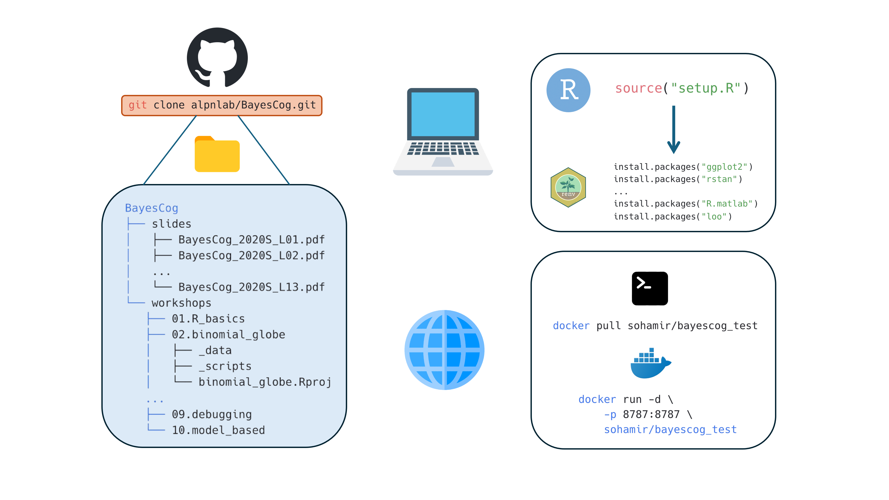

# Summary

We present \textbf{BayesCog} (\texttt{\url{https://alpn-lab.github.io/BayesCog}}), an openly-available online course for the computational modeling of human behaviour (i.e., cognitive modeling) using Bayesian inference, with reinforcement learning as a core example throughout the course. Assuming little to no prior experience, audience of this course will be formally grounded in key concepts including Bayesian statistics and reinforcement learning, and practically, will build, assess, compare, and validate models using the R interface to the Stan programming language, RStan. Starting with binary choice models, the audience will learn to estimate parameters representing latent components of behaviour by fitting reinforcement learning models, both at the individual and group-level, eventually with hierarchical modeling.

The course is generally suitable for those interested in developing models of human cognition at any level of experience. In making the course openly available, we aim for computational modeling under the Bayesian approach to be more strongly represented in the psychological sciences.

# Statement of Need

Computational modeling is a general framework that uses mathematical equations to infer unobserved latent processes, variables, and parameters from observed data. Whilst implemented in other disciplines (e.g., physics, chemistry, and, astronomy) for centuries, its application specifically towards understanding the human mind (i.e., learning, memory, decision-making, language) [@Farrell2018] is a relatively recent approach (known as cognitive modeling), one exponentially increasing in popularity [@Palminteri2017]. By formalising cognitive processes as mathematical operations and free parameters, cognitive models generate specific, testable hypotheses about observable behaviour, which can be objectively compared, verified, and falsified [@Guest2021; @Palminteri2017; @Pan2022; @Rocca2021; @Zhang2020]. When combined with other modalities of measurement, such as functional magnetic resonance imaging (fMRI), cognitive models present a key framework for understanding how the brain implements cognitive processes such as decision making and (social) learning [@Eckstein2021; @FeldmanHall2021] and their aberration in mental health disorders [@Hauser2022; @Huys2016; @Sohail2024].

Complementing this approach is the application of Bayesian methods for parameter estimation [@Annis2018], which applies the Bayes rule to obtain the posterior distribution of model parameters given the observed data (1):

\begin{equation}
P(\theta|D) = \frac{P(D|\theta) \cdot P(\theta)}{P(D)}
\end{equation}

where $P(\theta|D)$ is the posterior distribution, $P(D|\theta)$ is the likelihood, $P(\theta)$ is the prior distribution, and $P(D)$ is the marginal likelihood.

Bayesian methods confer advantages over frequentist approaches (e.g., Maximum Likelihood Estimation, MLE), by quantifying the uncertainty, and when implemented hierarchically, permit simultaneous estimation of individual and group-level parameters while appropriately pooling information across participants [@Lee2011]. Historically restrictive due to their computational burden, these methods are now more accessible though the development of multiple programming languages and software such as JAGS [@Plummer2003] and Stan [@Carpenter2017] which optimize the sampling process used for parameter estimation using approaches such as Markov chain Monte Carlo (MCMC).

Using Bayesian models of cognition in one’s own research requires a conceptual understanding of both Bayesian statistics and cognitive modeling, as well as the practical skills to translate these models into computer code. Textbooks [@Kruschke2014; @Lambert2018; @Lee2014; @McElreath2018] and tutorial papers [@Baribault2023; @Lockwood2021; @Wilson2019; @Zhang2020] have made learning these skills more accessible, but are often not freely available, and challenging for researchers, especially early career researchers with little to no prior experience. Additionally, whilst free, online courses for the computational modeling of cognition currently exist, these are few and far between, and exclusively cover non-Bayesian implementations in Python [@Rhoads2022] and MATLAB [@OReilly2015], as well as Bayesian approaches in Python [@NivLab2021]. A full course implementing Bayesian models of cognition through the open source R programming language is therefore a valuable yet currently non-existent resource.

BayesCog was originally developed by Lei Zhang at UKE Hamburg as a short course in Bayesian statistics and cognitive modeling for PhD students. The course was subsequently expanded by Lei at the University of Vienna, where the course received a Commendation Award from the Society for the Improvement of Psychological Science (SIPS), as well as an Early Career Teaching Award by the University. To make these materials more widely and openly available, Aamir Sohail, a PhD student working with Lei at the University of Birmingham, subsequently converted, edited, and expanded the source material into the present online course. Both authors are active researchers in computational modeling and cognitive neuroscience who have applied these Bayesian methods in their own empirical work which investigates the cognitive processes of learning and decision making in social contexts [@Zhang2020; @Crawley2020; @ZhangGlascher2020; @Sohail2026].

# Learning Objectives

In the course, students will:

\vspace{-1em}

-   Build a foundational knowledge of Bayesian statistics and inference, and how it differs from frequentist definitions of probability
-   Understand Bayesian parameter estimation and the conceptual basis of sampling techniques including Markov chain Monte Carlo (MCMC)
-   Understand how Bayesian statistics can be applied to uncover latent processes and parameters of cognition through cognitive modeling
-   Learn basic reinforcement learning (RL) concepts and build a simple RL model (Rescorla-Wagner) using RStan
-   Be able to evaluate model performance through model comparison, parameter recovery and posterior predictive checks

\begin{table*}[t]
\centering
\small
\caption{Conceptual foundations of the BayesCog course (Weeks 1--3).}
\begin{tabular}{p{1cm}p{2.2cm}p{4cm}p{7.3cm}}
\hline
\textbf{Week} & \textbf{Workshop} & \textbf{Topic} & \textbf{Focus} \\
\hline
1 & Workshop 1 & Introduction to R and RStudio & Foundational programming in R: data structures, packages, summary statistics and visualization \\
2 & Workshop 2 & Introduction to Bayesian statistics & Bayesian versus frequentist definitions of probability \\
3 & Workshop 3 & Bayesian inference and parameter estimation & Posterior estimation and Markov chain Monte Carlo sampling \\
\hline
\end{tabular}
\end{table*}

\begin{table*}[t]
\centering
\small
\caption{Practical modeling workshops of the BayesCog course (Weeks 4--9).}
\begin{tabular}{p{1cm}p{2.2cm}p{4cm}p{7.3cm}}
\hline
\textbf{Week} & \textbf{Workshop} & \textbf{Topic} & \textbf{Example task and model} \\
\hline
4 & Workshop 4 & Introduction to Stan and RStan & Coin-flipping experiment; binomial model \\
5 & Workshop 5 & Stan features, Bernoulli and regression & Coin flip and weight--height data; Bernoulli and linear regression models \\
6 & Workshop 6 & Reinforcement learning & Two-armed bandit task; Rescorla-Wagner RL model (single- and multi-subject) \\
7 & Workshop 7 & Hierarchical Bayesian modeling and optimization & Two-armed bandit task; hierarchical RL model \\
8 & Workshop 8 & Model comparison and validation & Probabilistic reversal-learning task; simple and fictitious-update RL models \\
9 & Workshop 9 & Debugging in Stan & Memory-retention task; exponential-decay model \\
\hline
\end{tabular}
\end{table*}

The course is roughly split into two sections, where students firstly learn Bayesian statistics and gain a basic familiarity with programming in Workshops 1-3 (Table 1). Subsequently, in Workshops 4-9 these skills are practically applied by building and fitting cognitive models in Stan (Table 2). Additionally, prior to the first workshop, the course begins by summarizing the broader philosophy in which the techniques and methods are implemented. Specifically, this concerns Marr’s influential three levels of analysis [@Marr1982], which describe how algorithmic-level (as opposed to computational and implementation levels) models can help understand behaviour. Doing so shapes the course material within this framework, demonstrating the necessity for building strong theories in psychology [@Press2022]. Assuming no prior experience with programming, the course properly (Workshop 1) begins with a basic introduction to the R programming language and the RStudio interface [@RStudio2020]. This introductory workshop first provides a general introduction to data structures, variables, and packages, after which students will work with simulated data from a reversal learning task, performing basic summary statistics including correlation and regression, and visualizing the results using the `ggplot2` package [@Wickham2016].

In Workshop 2, students will be introduced to Bayesian statistics, learning the differences between Bayesian and frequentist definitions of probability. These concepts are put into practical use in Workshop 3, where the Bayesian approach is transformed from a purely mathematical concept to a system where one can determine the values of unknown parameters from data. The goal of Bayesian inference - computing the probability distribution of model parameters given the observed data – is also introduced, together with sampling procedures which approximate the posterior distribution e.g., Markov chain Monte Carlo (MCMC). Workshop 4 subsequently introduces students to the Stan programming language [@Carpenter2017] and it’s R interface RStan [@StanTeam2024]. Following an overview of Stan syntax, students will construct a simple binomial model for a coin flipping experiment. Workshop 5 builds upon this introductory workshop by introducing some specific properties and advantageous features of Stan (as opposed to other packages like JAGS), including vectorization and variable declaration, and introduces two more models: the Bernoulli model and linear regression.

Having built a solid foundation of understanding Bayesian statistics in Workshops 1-5, in Workshops 6-8, students will learn how these methods can be used to infer latent cognitive processes. In Workshop 6, a basic overview to the principles of cognitive modeling is followed by an introduction to reinforcement learning, a popular theory of human behaviour that has been widely used in the last decades [@Dayan2008; @Lee2012; @Daw2011; @Niv2009]. To this end, we introduce a simple reinforcement learning algorithm consisting of the Rescorla-Wagner model [@Rescorla1972] that uses an error-driven rule (e.g., through reward prediction error) to update value computation, and a softmax choice rule quantifies the stochasticity and randomness in human action. Students will then practically implement this model in Stan, for simulated choice data for a single subject, before fitting multiple subjects. Workshop 7 directly builds upon this topic by introducing hierarchical Bayesian models [@Lee2012] for simultaneously estimating both group and individual level parameters. Given that Bayesian cognitive models often require troubleshooting for parameter estimation [@Baribault2023], optimization strategies are also introduced in this workshop. Specifically, this covers Stan’s sampling parameters and reparameterization; the latter being particularly relevant for hierarchical models. Model comparison is introduced in Workshop 8, with the basis behind model fitting, predictive accuracy and information criterion firstly described. Students will subsequently compare two RL models using the `loo` package [@Vehtari2015] in R, and plot posterior predictive checks as a measure of model validation. The final workshop (Workshop 9) describes key strategies for code writing styles and code debugging in Stan, using a purposely error-laden delay-discounting model [@Lee2014] for students to interactively troubleshoot problematic code. To conclude, a published study [@Crawley2020] where computational models were implemented to uncover learning differences is described, providing real-case examples of model and parameter recovery.

All course workshops are accompanied by example data and scripts, the latter provided in both uncompleted and completed versions where appropriate. All software required for the course are open-source and easy to install; instructions are provided in the ‘Course overview’ page. Whilst specific R packages (`rstan`, `loo`, `ggplot2`) are required, the course uses `renv` [@Ushey2023] to simplify the installation process. Users simply run a single command which installs the required packages for all successive R sessions. However, `renv` only provides a simplified solution to reproducibility and can be mired by system dependencies and versions of RStudio. Therefore, users can alternatively, pull a pre-made Docker image building a container locally to host the RStudio environment. This does not necessitate users to have R or RStudio installed - only Docker Desktop - maintaining a more consistent and reproducible development environment across different systems and platforms. In either case, generating the working environment requires minimal effort (Figure 1.). Detailed guidance on how to recreate the working environment in both cases are provided on the course website.

{width=100%} **Figure 1.** The course materials are hosted on GitHub and can be downloaded locally using the `git clone` command. Users have two options if wanting to replicate the working environment for the course materials. For working on one's own installation and version of RStudio, `renv` manages all required packages and dependencies. Conversely, if users would like to work on a specific RStudio version, they can pull the provided Docker image, which installs the required R packages on an RStudio server. In either case, the required dependencies are minimal (R/RStudio or Docker), and recreating the environment only involves running one or two simple commands. Icons from [icons8.com](https://icons8.com/)

The course is designed to be delivered over the span of a semester, with each workshop comprising approximately two to three hours (Tables 1 and 2). The first three workshops are conceptual, building the statistical foundations of the course, and so do not involve a worked task or model (Table 1). The remaining six workshops are practical and progressively build, fit, compare, and debug models of behaviour in Stan (Table 2). In principle the course can accommodate a class of any size; however, as students typically work through the materials hands-on, smaller cohorts of around 10 to 20 students are likely to be best suited, since debugging code and resolving individual technical issues can be time-consuming. We recommend that the instructor is proficient in R and Stan programming and has a strong understanding of Bayesian statistics. Familiarity with concepts in experimental psychology and neuroscience research is also preferred, to contextualize the example tasks and models. As the first workshop introduces core programming concepts at a relatively brisk pace, instructors teaching a programming-naive audience may wish to adapt this portion of the course—for example, by allocating additional time or directing students to supplementary resources—to ensure a solid foundation is built before progressing.

# Future Directions

The BayesCog course provides a general introduction to Bayesian statistics and computational modeling within the context of psychological research. Subsequently, the materials and topics could easily be developed further. This includes using computational methods with neuroimaging data [@Glascher2010; @deHollander2016], understanding behaviours in the social world [@Kutlikova2023; @Pan2023], and the theory-based modeling of psychiatric disorders [@Maia2017; @Sohail2024; @Suter2025]. Furthermore, the Stan programming language remains technically challenging, leading to the development of user-friendly packages for computational modeling [@Ahn2017]. Tutorials on how to implement these packages could further broaden the use of computational methods within the psychological sciences. In the era of large language models (LLMs) and generative AI, the audience are also encouraged to combine this course with LLM tools such as ChatGPT to explore a more tailored learning experience [@Sohail2025a; @Lin2026].

To this end, we openly receive feedback and suggestions from the wider community. Any tutorial can be adopted, transformed, or built upon for other educational purposes (e.g., courses, single class sessions, workshops) under a Creative Commons Attribution-ShareAlike 4.0 International License, while the accompanying code (the R scripts and Stan models) is released under the MIT License. Broader comments can be communicated on the [GitHub repository](https://github.com/Alpn-Lab/BayesCog/issues) by either reporting an issue or requesting an enhancement. On-the-other-hand, we recommend major changes to be made communicated beforehand and – if appropriate - made directly by forking the repository and pushing changes to the main branch. A member of the contributing team will then review the changes. Accepted contributions will be credited and acknowledged in the Contributors section of the repository README.

# Acknowledgments

[A.S.](https://sohaamir.github.io/) would like to thank Lei Zhang for developing the initial version of these materials, including slides, code, and GitHub repositories. A.S. and [L.Z](https://lei-zhang.net/) would also like to acknowledge existing open-source materials, including Shawn Rhoads’ 'Computational Models of Human Social behaviour and Neuroscience' [@Rhoads2022], Luke Chang’s 'DartBrains: An online open access resource for learning functional neuroimaging analysis methods in Python' [@Chang2020] and Magdalena Chechlacz’s 'MRI on BEAR' [@Sohail2025b], who influenced the development of these materials.

L.Z. is supported by the Wellcome Trust (228268/Z/23/Z) and Royal Society (IES\\R3\\243253). A.S. is supported by an MRC AIM iCASE DTP Studentship (Ref: MR/W007002/1).

# Author Contributions

L.Z. created, designed and taught the original course materials by developing the syllabus, writing the Stan and R code and creating and interpreting the datasets. A.S. created the website, adding the content by converting, editing and expanding the source material written by L.Z. Both L.Z. and A.S. revised the course materials and wrote the manuscript.

# References
